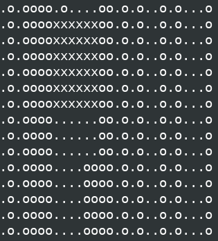

# BSQ

{EPITECH} The goal of this project is to find the biggest square in a map made up of '.' and 'o'.

## HOW TO USE

### REQUIREMENT

```
gcc
make
ncurses (for the bonus)
```
### USAGES

Compilation

```
make
```
Execution

```
./bsq maps/map1
```
### BONUS

Go to the bonus directory and do the previous actions.

## SCREENSHOTS



## DEVELOPMENT

* [C](https://fr.wikipedia.org/wiki/C_(langage))
* [NCURSES](https://fr.wikipedia.org/wiki/Ncurses)

## AUTHOR

* **Ilan Benarroche** - [Ilano30](https://github.com/Ilano30)